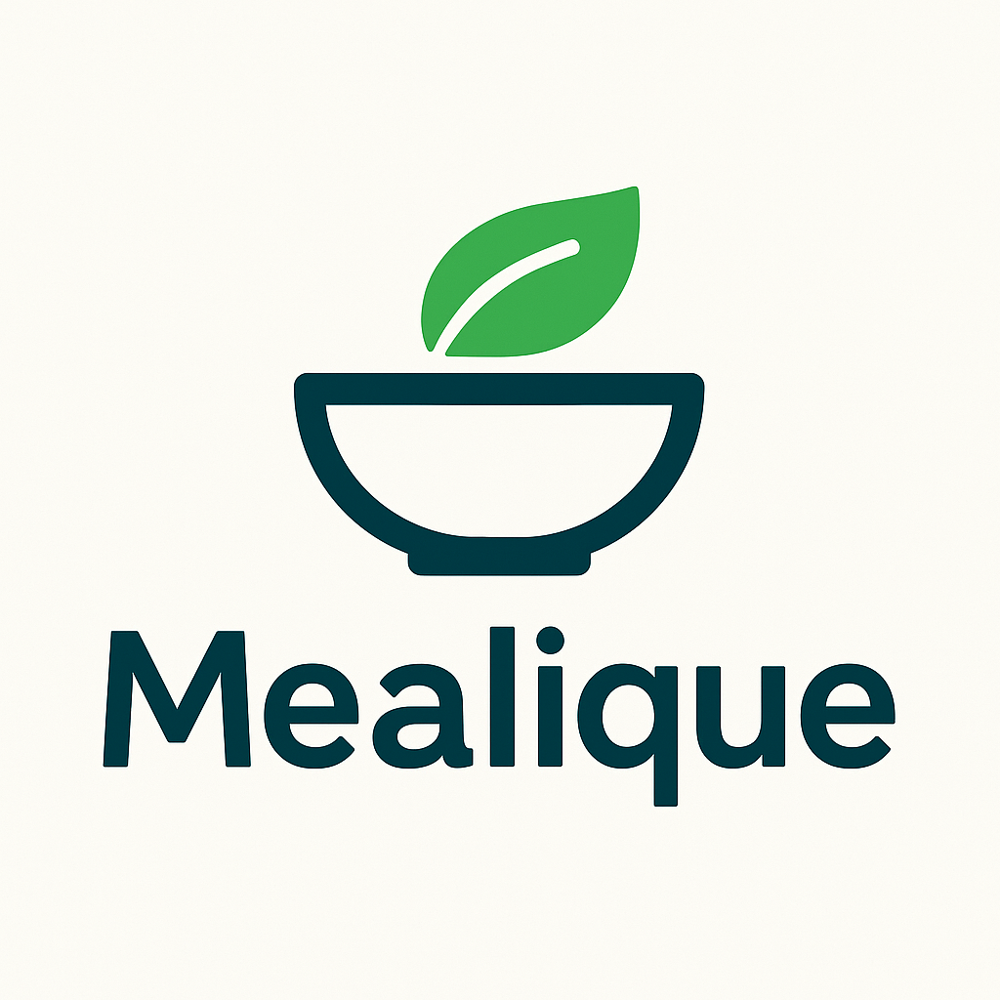
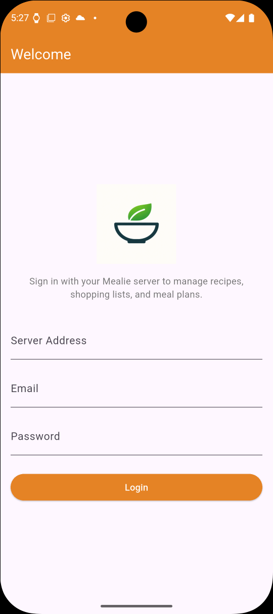
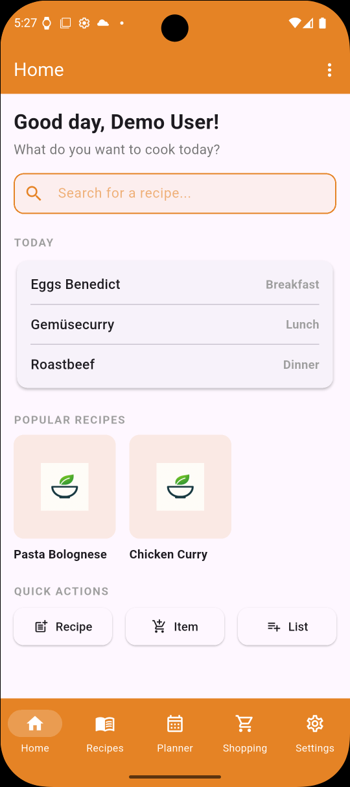
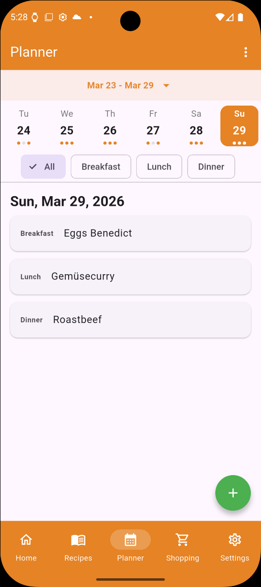
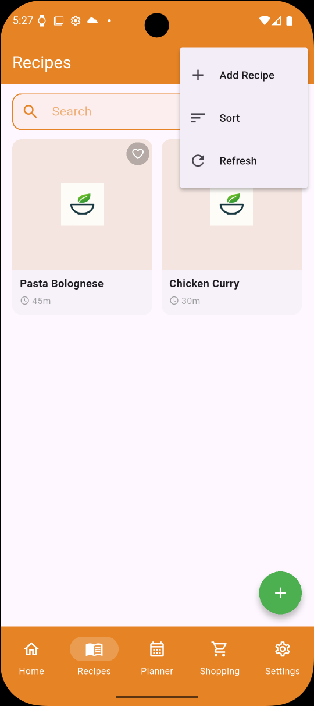
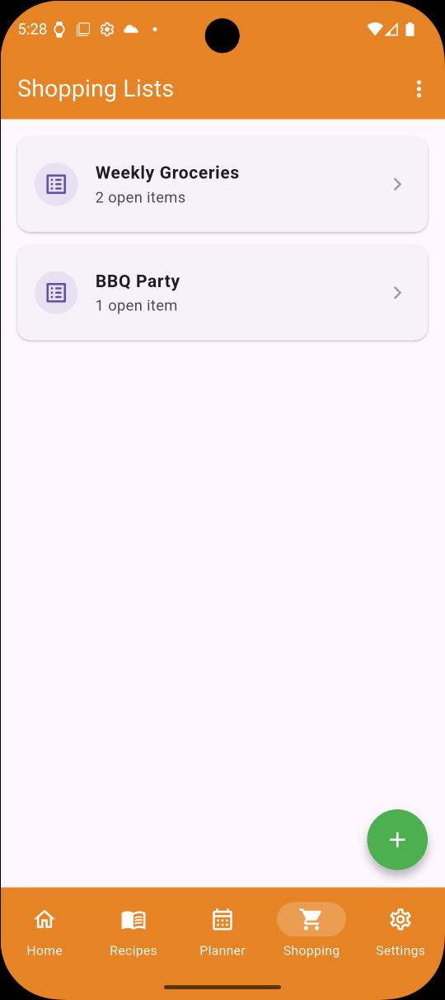
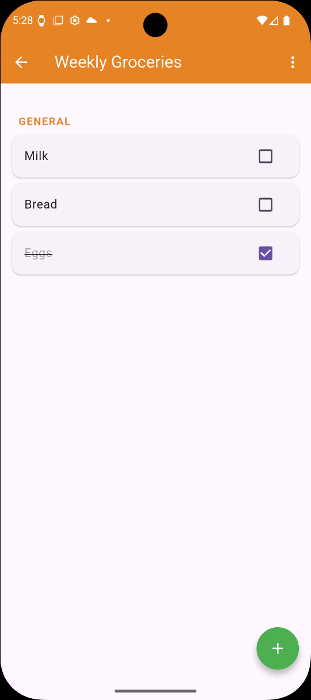

# Mealique

<div align="center">
  
</div>

Mealique is an unofficial Flutter client for Mealie, the self-hosted recipe manager and meal planner. It connects to your Mealie server to organize meals, sync and discover recipes, and create shopping lists. With an intuitive interface and powerful features, Mealique makes planning and managing meals from Mealie easy and enjoyable on mobile devices.

> [!WARNING]
> **This project is in an early development stage.** Features may be incomplete, and bugs are to be expected. Use with caution in production environments.

## Features

- **Recipe Management**: Browse, search, and view your entire recipe collection synced from your Mealie server.
- **Meal Planning**: Plan your weekly meals with an easy-to-use calendar interface.
- **Shopping Lists**: Automatically generate shopping lists based on your meal plan or selected recipes.
- **Offline Access**: Access your recipes and shopping lists even without an internet connection.
- **Intuitive Interface**: Designed for a seamless mobile experience with smooth navigation and gestures.
- **Open Source**: Built with Flutter, ensuring transparency and community-driven improvements.

## Screenshots

### Smartphone

|  |  |  |
|:-----------------------------------------------------:|:---------------------------------------------------------:|:-------------------------------------------------------:|
|                    *Login Screen*                     |                        *Dashboard*                        |                        *Planner*                        |


|  |  |  |
|:-------------------------------------------------------:|:-------------------------------------------------------------:|:---------------------------------------------------------------------:|
|                        *Recipes*                        |                        *Shopping List*                        |                        *Shopping List Details*                        |
### Tablet

## Installation

### Google Play (Closed Testing)

The app is available as a closed test on Google Play:

<a href="https://play.google.com/apps/testing/de.mealique.app">
  
</a>

### Build from Source

You can also build the app from source or install the APK directly if available.

1.  **Clone the repository:**
    ```bash
    git clone https://github.com/matti122/mealique.git
    ```
2.  **Navigate to the project directory:**
    ```bash
    cd mealique
    ```
3.  **Install dependencies:**
    ```bash
    flutter pub get
    ```
4.  **Run the app:**
    ```bash
    flutter run
    ```

## Roadmap

- [x] **Core Features**
  - [x] User Authentication with Mealie API
  - [x] Browse, search, and view recipes
- [ ] **Shopping List**
  - [x] View and manage multiple shopping lists
  - [ ] Add recipes to a shopping list
  - [x] Mark items as completed
  - [x] Add and edit Shopping List items
- [x] **Meal Planner**
  - [x] View the weekly meal plan
  - [x] Add/remove recipes from the meal plan
  - [ ] Automatically generate shopping list from the plan
- [ ] **User Experience**
  - [x] Implement localization (EN, DE)
  - [ ] Full Dark Mode
  - [ ] Tablet-optimized UI
  - [x] Advanced recipe filtering (by category, tag, etc.)
- [ ] **Advanced Features**
  - [x] Create and edit recipes within the app
  - [ ] Manage Mealie user settings and preferences
  - [ ] Pantry management
  - [ ] Notifications
  - [ ] Cookbooks
  - [ ] Wear OS companion APP
- [ ] **Offline Support**
  - [ ] Shopping List
  - [ ] Shopping List items
  - [ ] Meal Planner
  - [ ] Recipes
  - [ ] Cookbooks


Alternatively, check the [Releases](https://github.com/matti122/mealique/releases) page for the latest APK to install on your Android device.
